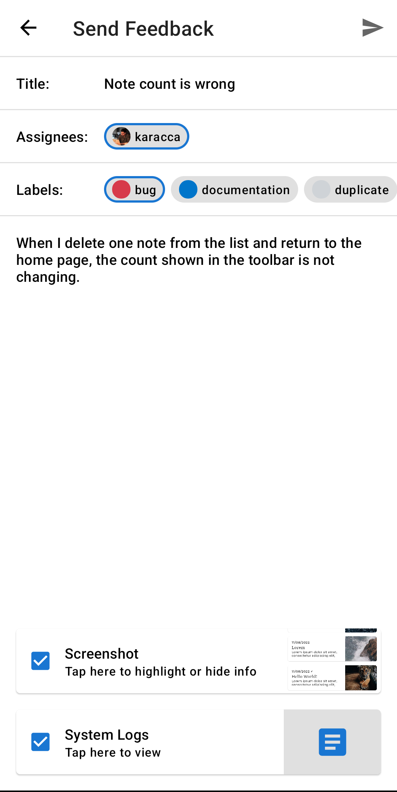
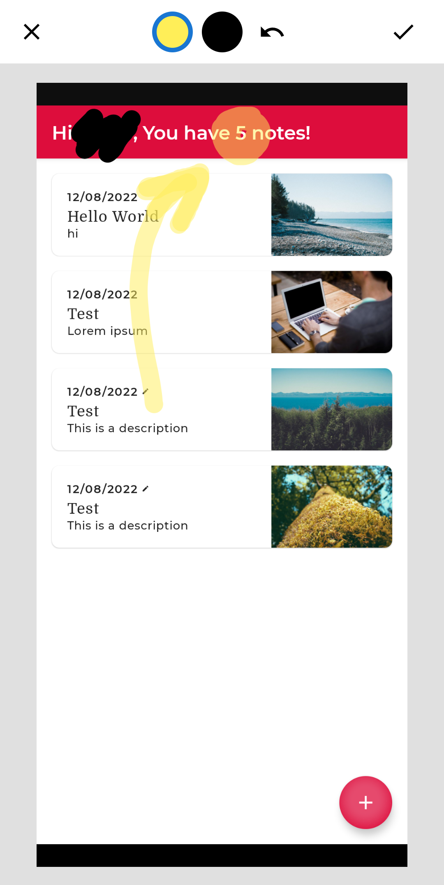

<h1> Beetle [WIP ⚙️]</h1>

[](https://github.com/karacca/beetle/actions/workflows/Build.yaml)
[](https://search.maven.org/artifact/com.karacca/beetle)
[](https://www.apache.org/licenses/LICENSE-2.0)

Collect feedback & bug reports on your Android apps into your GitHub Issues.

## Introduction & Features

Beetle is a lightweight Android library that enables your users to submit feedback from their applications. It uses GitHub API and collect users feedbacks as GitHub Issues like [this one](https://github.com/karacca/beetle/issues/30).

* Shake gesture detection for starting a feedback process
* Collect information about the device. You can also add extra information you may add using `Beetle.configure()`
* Users can add Title & Description about the Issue they are having
* Users can assign developers & labels to the Issue
* Current screenshot will be added to the Issue and also can be edited by the user
* JIRA Integration (Coming soon 🚀)

## Screenshots

 

## Download & Quick Start

1. Install [Beetle](https://github.com/marketplace/beetle-app) to your GitHub repository so it can take action on your behalf and create Issues
2. Add Beetle dependency to your Android app
```kotlin
dependencies {
    implementation("com.karacca:beetle:2.0.0")
}
```
3. Initialize Beetle inside your Application
```kotlin
class MyApplication : Application() {

    override fun onCreate() {
        super.onCreate()
        Beetle.init(this, "username", "repository")
    }
}
```
4. [Optional] Make configurations and add additional data
```kotlin
Beetle.configure {
    enableAssignees = true
    enableLabels = true
    key("user_id", user.id)
}
```

## License

    Copyright 2022 Omer Karaca

    Licensed under the Apache License, Version 2.0 (the "License");
    you may not use this file except in compliance with the License.
    You may obtain a copy of the License at

       https://www.apache.org/licenses/LICENSE-2.0

    Unless required by applicable law or agreed to in writing, software
    distributed under the License is distributed on an "AS IS" BASIS,
    WITHOUT WARRANTIES OR CONDITIONS OF ANY KIND, either express or implied.
    See the License for the specific language governing permissions and
    limitations under the License.
