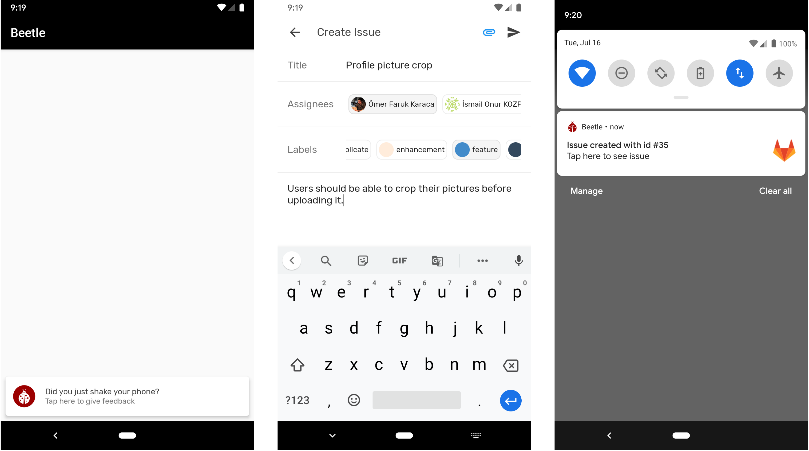

Shake to create Bug Report on GitHub, GitLab and Azure DevOps!

[](https://jitpack.io/#karacce/Beetle)

# Screenshots


# Introduction
Beetle allow your QA team to easily create issues on __GitHub__, __GitLab__ and __Azure DevOps__ by shaking their device. It is initialized in Application class with agent credentials and doesn't require any additional permissions.

# Features
* Directly creates issues from the device with only one easy step
* Adds current screenshot as Attachment. (GitLab, Azure DevOps)
* Assign issues to related users
* Add Labels (GitHub, GitLab)
* (Coming Soon) Include device info in issue description

# Installation & Usage
**1.** Add it in your root build.gradle file.
```groovy
allprojects {
	repositories {
		...
		maven { url 'https://jitpack.io' }
	}
}
```
**2.** Add the dependency
```groovy
dependencies {
	  implementation 'com.github.karacce:Beetle:{latest-version}'
}
```
**3.** Initialize Beetle in `Application` file
```kotlin
class SampleApplication: Application() {

    override fun onCreate() {
        super.onCreate()
        
        /** Initialize with Azure DevOps **/
        Beetle.azure(this, "karacce", "Beetle", "karacce@gmail.com", "token")
        
        /** Initialize with GitHub **/
        Beetle.github(this, "karacce", "Beetle", "token")
        
        /** Initialize with GitLab **/
        Beetle.gitlab(this, 12899898, "token")
    }
}
``
